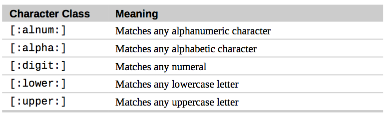
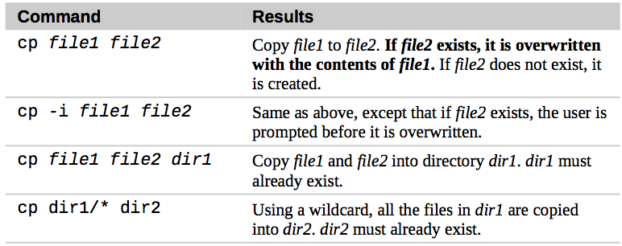
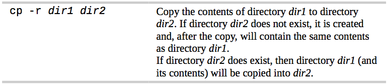
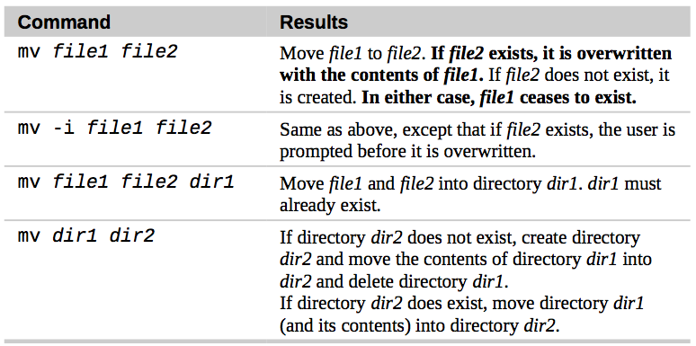
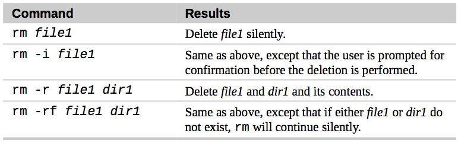

# Manipulating files and directories
### Wildcards
use  wildcards allows you to select filenames based on patterns of characters.

#### wildcards:
| wildcard | Meaning |
| -------- | ------- |
| * | Matches any characters |
| ? | Matches any single character |
| [characters] | Matches any character that is a member of the set characters |

Commonly Used character Classes:



#### Wildcards Work In the GUI Too
- In **Nautilus** (the file manager for GNOME), you can select files using the Edit/Select Pattern menu item. Just enter a file selection pattern with wild- cards and the files in the currently viewed directory will be highlighted for se- lection.

- In some versions of **Dolphin** and **Konqueror** (the file managers for KDE), you can enter wildcards directly on the location bar. For example, if you want to see all the files starting with a lowercase “u” in the /usr/bin directory, enter “/usr/bin/u*” in the location bar and it will display the result.

### mkdir - create directories

```
mkdir dir1

mkdir dir1 dir2 dir3 dir4
```
you can use `mkdir` to create one or more directories as you need.

### cp - copy files and directories
```
cp item1 item2

cp item... directory
```

#### cp examples:




### mv - move and rename files

```
mv item1 item2

mv item... directory
```

#### mv examples:



### rm - remove files and directories

```
rm item...
```

#### rm examples:



**Note: Be careful with `rm` !**
- Unix-like operating systems such as Linux do not have an undelete command. Once you delete something with rm, it's gone.

Before you use `rm` with wildcards to delete files, using `ls` first to check the files that will be deleted.

### ln - create Links

- create a hard link
```
ln file link
```

- create a symbolic link
```
ln -s item link
```
here, item is either a file or a directory.

#### Hard links
**By default, every file has a single hard link that gives the file its name.** When we create a hard link, we create an additional directory entry for a file.

- When thinking about hard links, it is helpful to imagine that files are made up of two parts: the data part containing the file's contents and the name part which holds the file's name. When we create hard links, we are actually creating additional name parts that all refer to the same data part. The system assigns a chain of disk blocks to what is called an **inode**, which is then associated with the name part. Each hard link therefore refers to a specific inode containing the file's contents.

Use `ls -li`, you can see the inode of each file.

Important limitations:

- 1\. A hard link cannot reference a file outside its own file system. This means a link cannot reference a file that is not on the same disk partition as the link itself.

- 2\. A hard link may not reference a directory.

- 3\. When a hard link is deleted, the link is removed but the contents of the file itself continue to exist (that is, its space is not deallocated) until all links to the file are deleted.

#### Symbolic Links

One thing to remember about symbolic links is that **most file operations are carried out on the link's target, not the link itself.**

Be careful when you use `rm`.When you delete a link, it is the link that is deleted, not the target.

**Creating Symlinks With The GUI :**

The file managers in both GNOME and KDE provide an easy and automatic method of creating symbolic links.
- GNOME : Holding the *Ctrl+Shift* keys while dragging a file will create a link rather than copying (or moving) the file.

- KDE : A small menu appears whenever a file is dropped, offering a choice of copy- ing, moving, or linking the file.
