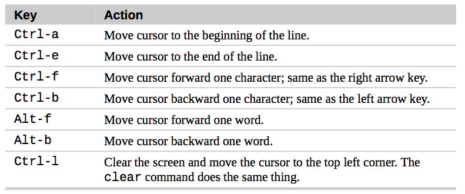

# Advanced keyborad tricks
- In fact, one of the most cherished goals of the command line is laziness; doing the most work with the fewest number of keystrokes.

- Another goal is never having to lift your fingers from the keyboard, never reaching for the mouse.

### Command Line Editing

#### Cursor Movement



#### Modifying Text


p.s. I have tried  some but I don't think it is useful.:-|

#### Cutting And Pasting (Killing And Yanking) Text

Items that are cut are stored in a buffer called *the kill-ring*.


### Completion
key: **tab**


Programmable completion allows you (or more likely, your distribution provider) to add additional completion rules. Usually this is done to add support for specific applications.

### Using History

The list of commands is kept in your home directory in a file called **.bash_history**.

#### Search History
```
history | less
```

- By default, bash stores the last 500 commands we have entered, though most modern distributions set this value to 1000.

Instruction:
- To start incremental search press **Ctrl-r** followed by the text you are looking for.

- To find the next occurrence of the text (moving “up” the history list), press **Ctrl-r** again.

- To quit searching, press either **Ctrl-g** or **Ctrl-c**.


#### History Expansion
The shell offers a specialized type of expansion for items in the history list by using the `!` character.


---
##### script

In addition to the command history feature in bash, most Linux distributions include a program called script that can be used to record an entire shell session and store it in a file. The basic syntax of the command is:
```
script [file]
```
where file is the name of the file used for storing the recording.
