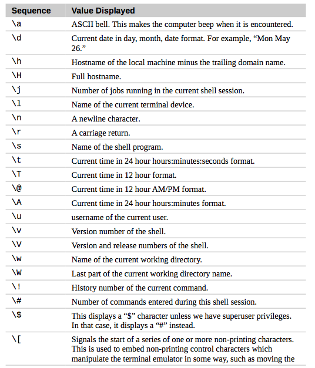
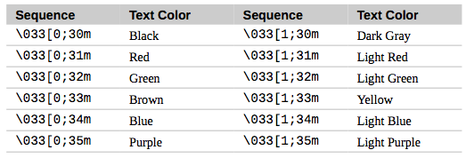
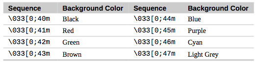
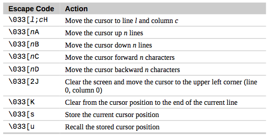

# Customizing the prompt

### Anatomy of A prompt

The prompt is defined by an environment variable named PS1 (short for “prompt string one”).

```
echo $PS1
```

Escape Codes Used In Shell Prompts :


\\\]=  : Signals the end of a non-printing character sequence.

### Trying Some Alternative Prompt Designs

```
ps1_old=$PS1
echo $ps1_old
PS1="\$ "
output : $
```

more designs:

```
PS1="<\u@\h \w>\$ "
PS1="\A \h \$ "
```

### Adding Color

Escape Sequences Used To Set Text Colors:



```
PS1="\[\033[0;31m\]<\u@\h \W>\$ "
```

That works, but notice that all the text that we type after the prompt is also red. To fix this, we will add another escape code to the end of the prompt that tells the terminal emulator to return to the previous color:

```
PS1="\[\033[0;31m\]<\u@\h \W>\$\[\033[0m\] "
```

Escape Sequences Used To Set Background Color:



```
PS1="\[\033[0;41m\]<\u@\h \W>\$\[\033[0m\] "
```

### Moving The Cursor

Cursor Movement Escape Sequences:




```
PS1="\[\033[s\033[0;0H\033[0;41m\033[K\033[1;33m\t\033[0m\033[u\]<\u@\h \W>\$ "
```

### Saving The Prompt

```
export PS1
```
